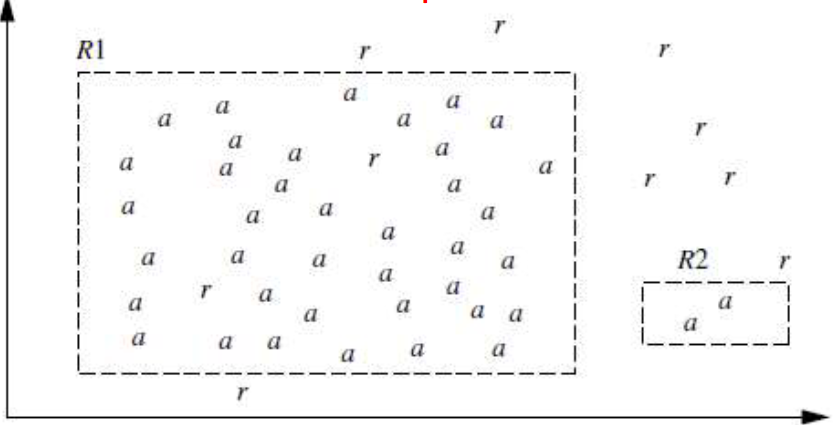

# Business Intelligence
**G. Mudare**

---

## Rule-Based Classification

- IN rule-based classifiers, the learned model is represented as a set of IF-THEN rules.
- First examine how such rules are used for classification.
- There are ways that can be generated, either from a decision tree or directly from the training data using a **sequential covering algorithm**.

---

## Using IF-THEN Rules for Classification

- A rule-based classifier uses a set of **IF-THEN** rules for classification. And is an expression of the form:

### **IF** *condition* **THEN** *conclusion*.

- An example is rule R1,

**R1:**
- **IF** *age = youth* **AND** *student = yes* **THEN** *buys computer = yes*.

---

## Using IF-THEN Rules for Classification

- The "**IF**"-part of a rule is the rule **antecedent** or **precondition**.
- The "**THEN**"-is the rule **consequent**.
- In the rule antecedent, the condition consists of one or more **attribute tests** (such as *age = youth*, and *student = yes*) that are logically **AND**ed.
- The rule's **consequent** contains a **class prediction**
- R1 can also be written as
- **R1: IF** *age = youth* **AND** *student = yes* **THEN** *buys computer = yes*.

---

## Using IF-THEN Rules for Classification

- If the condition in a rule antecedent holds true for a given tuple, → rule antecedent is satisfied and that the rule covers the tuple.
- rule R can be assessed by its **coverage** and **accuracy**.
- Given a tuple, X, from a class labelled data set, D, let n_covers be the number of tuples **covered** by R;
- n_correct be the number of tuples **correctly** classified by R; and |D| be the number of tuples in D.
- Define the **coverage** and **accuracy** of R as

```
coverage(R) = n_covers / |D|
accuracy(R) = n_correct / n_covers
```

---

## Using IF-THEN Rules for Classification

- a **rule's coverage** is the percentage of tuples that are **covered** by the rule
- For a **rule's accuracy**, we look at the tuples that it **covers** and see what **percentage of them the rule can correctly classify**.

---

## Using IF-THEN Rules for Classification
### Example: Rule accuracy and coverage

From the table, these are class-labelled tuples from a customer database.

| RID | age | income | student | credit_rating | Class: buys_computer |
|-----|-----|--------|---------|---------------|---------------------|
| 1 | youth | high | no | fair | no |
| 2 | youth | high | no | excellent | no |
| 3 | middle_aged | high | no | fair | yes |
| 4 | senior | medium | no | fair | yes |
| 5 | senior | low | yes | fair | yes |
| 6 | senior | low | yes | excellent | no |
| 7 | middle_aged | low | yes | excellent | yes |
| 8 | youth | medium | no | fair | no |
| 9 | youth | low | yes | fair | yes |
| 10 | senior | medium | yes | fair | yes |
| 11 | youth | medium | yes | excellent | yes |
| 12 | middle_aged | medium | no | excellent | yes |
| 13 | middle_aged | high | yes | fair | yes |
| 14 | senior | medium | no | excellent | no |

- Our task is to predict whether a customer will buy a computer.
- **R1: IF** *age = youth* **AND** *student = yes* **THEN** *buys computer = yes*.
- R1 covers 2 of the 14 tuples.
- It can correctly classify both tuples. Therefore,
- **coverage**(R1) = 2/14 = 14.28% and **accuracy**
- (R1) = 2/2 = 100%.

---

## Using IF-THEN Rules for Classification

- How can we use rule-based classification to predict the class label of a given tuple, X?
- If a **rule is satisfied** by X, the rule is said to be **triggered**

**X = (age = youth, income = medium, student = yes, credit_rating = fair).**

Classify X according to *buys computer*.
X satisfies **R1**, which triggers the rule.
If R1 is the only rule satisfied, then the rule fires by returning the class prediction for X.
**Note** that triggering does not always mean firing because there may be more than one rule that is satisfied!
If more than one rule is triggered, we have a potential problem.

---

## Using IF-THEN Rules for Classification

1. What if they each specify a different class?
2. Or what if no rule is satisfied by X?

- **first question.**
  → If more than one rule is triggered, we need a **conflict resolution strategy** to figure out which rule gets to fire and assign its class prediction to X.
- There are many possible strategies.
1. **size ordering**
2. **rule ordering.**

---

## Size Ordering

- The **size ordering** scheme assigns the highest priority to the triggering rule that has the "**toughest**" requirements,
- **Toughness** is measured by the rule **antecedent size**. (the triggering **rule with the most attribute tests is fired**)
- Overall the rules are **unordered**.
  → They can be applied in any order when classifying a tuple. (disjunction (**logical OR**) is implied between each of the rules.
- Each rule represents a stand-alone nugget or piece of knowledge.

---

## Size Ordering Scheme

- The **size ordering** scheme assigns the highest priority to the triggering rule that has the "**toughest**" requirements, where toughness is measured by the rule **antecedent size**. That is, the triggering **rule with the most attribute tests is fired**.
  → **Triggering rule:** A rule whose antecedent (the "if" part) matches the current example.
  → **Toughest requirement:** The rule with the strictest or most specific conditions.
  → **Rule antecedent size:** The number of attribute tests in the rule's condition (e.g., R1: IF Age = youth AND Student = yes THEN Buys_computer = yes has size 2).
  → **Size ordering scheme:** When several rules match, you **choose the one** with the **largest antecedent size** (i.e., the most conditions).

---

## Size Ordering Scheme

- **R1: IF** *Age = youth* **AND** *Student = yes* **THEN** *Buys_computer = yes* (antecedent size = 2)
- **R2: IF** *Income = high* **THEN** *Buys_computer = no* (antecedent size = 1)
- **R3: IF** *Age = middle-aged* **THEN** *Buys_computer = yes* (antecedent size = 1)

**triggered Rules:**
- R1: matches (Age = youth, Student = yes)
- R2: matches (Income = high)
- R3: does not match (Age ≠ middle-aged)

**Conflict Resolution: Size Ordering Scheme**
- R1 antecedent size = 2
- R2 antecedent size = 1
- **R1 preferred** (more specific, "tougher" conditions).

**Final classification:** Buys_computer = yes.
**Size ordering prefers the most specific rule when multiple rules apply.**

---

## Rule Ordering

- The **rule ordering** scheme prioritizes the rules beforehand.
- The ordering may be **class based** or **rule-based**.
- With **class-based ordering**, the classes are **sorted in order of decreasing "importance,"** such as by **decreasing order of prevalence**. (all of the rules for the most prevalent class come first, the rules for the next prevalent class come next, and so on.)
- They may also be sorted based on the **misclassification cost per class**.
- With **rule-based ordering**, the rules are organized into one long priority list, according to some measure of **rule quality** such as **accuracy, coverage, or size**, or **based on advice from domain experts**.
- When rule ordering is used, the rule set is known as a **decision list**.
- With rule ordering, **the triggering rule that appears earliest in the list has highest priority, and so it gets to fire its class prediction**.
- **Any other rule that satisfies X is ignored**.
- **Most rule-based classification systems use a class-based rule-ordering strategy**.

---

## Rule Ordering

- The **rule-ordering (decision list) scheme rules must be applied in the prescribed order so as to avoid conflicts**.
- **Each rule in a decision list implies the negation of the rules that come before it in the list**.
- **Hence, rules in a decision list are more difficult to interpret**.

---

## Class-Based Ordering

- In **class-based ordering** (sometimes called class **priority ordering**), we don't look at the size of the rule antecedent, but instead at the **importance of the class** that the rule predicts.
  → The classes are ranked beforehand, often by: **Prevalence** (most frequent class comes first),
  → **Domain importance** (e.g., "Buys_computer" more important than "not-Buys_computer"),
  → Or some other external criterion.
- When multiple rules are triggered, the rule **predicting the highest-ranked class is preferred**.

---

## Example with AllElectronics

- Determine class importance by prevalence in the training data. Imagine the class distribution is:
  → Buys_computer = no → 9 cases
  → Buys_computer = yes → 5 cases
- **importance order is: No > Yes.**
- **Rules**
  → **R1: IF** *Age = youth* **AND** *Student = yes* **THEN** *Buys_computer = yes*
  → **R2: IF** *Income = high* **THEN** *Buys_computer = no*
  → Both R1 and R2 fire.
  - R1 predicts Yes
  - R2 predicts No
- **Using Class-Based Ordering**
  - Class importance order: No > Yes
  - **R2 is preferred** (because it predicts the more important class, even though R1 is more specific)
- .**Final classification:** Buys_computer = no.
- **Size ordering** → prefers the most specific rule.
- **Class-based ordering** → prefers the rule predicting the most important class.

---

## Misclassification Cost

- Another common criterion is the **misclassification cost** per class.
- Some classes are costlier to misclassify than others.

Let's assume misclassification costs:
→ Predicting **No** when actual is **Yes** → Cost = 5 (lost customer)
→ Predicting **Yes** when actual is **No** → Cost = 1 (wasted marketing effort)

- **Rules**
  - R1: IF Age = youth AND Student = yes THEN Buys_computer = yes
  - R2: IF Income = high THEN Buys_computer = no
- **Both R1 and R2 fire:**

  → R1 → predicts Yes

  → R2 → predicts No

→ **Conflict Resolution by Misclassification Cost Ordering**
- **Yes** class is more important (**higher misclassification cost**).
- **R1 preferred**.

---

## Determining the class label of X
### Where NO RULE SATISFIED BY X

- A fallback or **default rule** can be set up to specify a default class, based on a training set.
- This may be the **class in majority** or the **majority class of the tuples that were not covered by any rule**.
- The **default rule is evaluated at the end**,

  → if and only if no other rule covers X.

  → The condition in the default rule is empty. → the rule fires when no other rule is satisfied.

---

## Determining the class label of X?

- Decision tree classifiers are a popular method of classification—
- it is easy to understand how decision trees work and they are known for their accuracy.
- Decision trees can become large and difficult to interpret.
- We want to look at how to build a rule based classifier by **extracting IF-THEN rules from a decision tree**.
- In comparison with a decision tree, the IF-THEN rules may be easier for humans to understand, particularly if the decision tree is very large.
- To extract rules from a decision tree, **one rule is created for each path from the root to a leaf node**.
- **Each splitting criterion along a given path is logically ANDed to form the rule antecedent** ("IF" part).
- **The leaf node holds the class prediction, forming the rule consequent** ("THEN" part).

---


## Extracting Classification Rules from a Decision Tree

The decision tree can be converted to classification IF-THEN rules by tracing the path from the root node to each leaf node in the tree.

A disjunction (logical OR) is implied between each of the extracted rules Because the rules are extracted directly from the tree, they are **mutually exclusive and exhaustive** (no conflicts).

**Decision Tree:**

```
                          age?
               /           |          \
            youth     middle_aged    senior
               |           |           |
           student?        |      credit_rating?
           /      \        |       /           \
         yes      no       |     fair      excellent
          |       |        |      |            |
        yes      no       yes     no          yes
```

**Extracted Rules:**
```
R1: IF age = youth    AND student = no     THEN buys_computer = no
R2: IF age = youth    AND student = yes    THEN buys_computer = yes
R3: IF age = middle_aged                   THEN buys_computer = yes
R4: IF age = senior   AND credit_rating = excellent THEN buys_computer = yes
R5: IF age = senior   AND credit_rating = fair      THEN buys_computer = no
```

---

## How can we prune the rule set?

- For a given **rule antecedent**, any **condition that does not improve the estimated accuracy of the rule can be pruned** (i.e., removed), thereby **generalizing the rule**.
- Problems arise during rule pruning, however, as the rules **will no longer be mutually exclusive and exhaustive**

---

## Rule Induction Using a Sequential Covering Algorithm

- IF-THEN rules can be extracted directly from the training data (i.e., without having to generate a decision tree first) using a **sequential covering algorithm**.
- Sequential covering algorithms are the most widely used approach to mining disjunctive sets of classification rules,
- Classification rules can be generated using **associative classification algorithms**, which search for attribute-value pairs that occur frequently in the data.
- These pairs may form **association rules**, which can be analysed and used in classification.
- **Rules are learned one at a time**.
- **Each time a rule is learned, the tuples covered by the rule are removed, and the process repeats on the remaining tuples**.

---

## Sequential Covering Algorithm

**Dataset:** We use the AllElectronics customer database to demonstrate the sequential covering algorithm.

| RID | Age | Income | Student | Credit_Rating | Class: Buys_Computer |
|-----|-----|--------|---------|---------------|---------------------|
| 1 | youth | high | no | fair | no |
| 2 | youth | high | no | excellent | no |
| 3 | Middle_Aged | high | no | fair | yes |
| 4 | Senior | Medium | no | fair | yes |
| 5 | Senior | Low | yes | fair | yes |
| 6 | Senior | Low | yes | excellent | no |
| 7 | Middle_Aged | Low | yes | excellent | yes |
| 8 | youth | Medium | no | fair | no |
| 9 | youth | Low | yes | fair | yes |
| 10 | Senior | Medium | yes | fair | yes |
| 11 | youth | Medium | yes | excellent | yes |
| 12 | Middle_Aged | Medium | no | excellent | yes |
| 13 | Middle_Aged | high | yes | fair | yes |
| 14 | Senior | Medium | no | excellent | no |

**Step 1: Define Examples**
We classify the training data into positive and negative examples based on the target class:
- **Positive examples** = Buys_Computer = Yes (Rows: 3, 4, 5, 7, 9, 10, 11, 12, 13)
- **Negative examples** = Buys_Computer = No (Rows: 1, 2, 6, 8, 14)

**Step 2: Algorithm Overview**
- **Goal:** Generate IF-THEN rules that cover all positive examples without covering negatives.
- **Strategy:** The sequential covering algorithm works by finding rules that cover subsets of positive examples while avoiding negative examples. This is different from decision trees that partition the entire dataset.

**Algorithm Steps:**
1. **Start with all positive examples** (initially 9 positive examples: rows 3,4,5,7,9,10,11,12,13)
2. **Calculate Information Gain for each attribute-value combination:**
   - For each attribute (Age, Income, Student, Credit_Rating)
   - For each possible value of that attribute
   - Calculate how well that combination separates positive examples from negative examples
   - **Constraint:** Only consider combinations that cover zero negative examples (pure rules)
3. **Select the combination with highest Information Gain** that satisfies the purity constraint
4. **Create a rule** from this best combination and add it to the rule set
5. **Remove the covered positive examples** from consideration (they're now handled by this rule)
6. **Repeat until all positive examples are covered** by at least one rule

**Key Principles:**
- Each rule must be "pure" - it can only predict positive outcomes, never negative ones
- Among all pure combinations, we choose the one that provides the most information gain

---

**Step 3: Rule Generation Process**

### **Information Gain Calculation Process**
Before generating each rule, we systematically evaluate all possible attribute-value combinations:

**Current state:** All positive examples (rows 3,4,5,7,9,10,11,12,13) need to be covered

**Evaluate each possible combination:**
1. **Age=Youth:** Covers positives 9,11 but also negative 1,2,8 → **REJECTED** (not pure)
2. **Age=Middle-aged:** Covers positives 3,7,12,13 and no negatives → **CANDIDATE**
3. **Age=Senior:** Covers positives 4,5,10 but also negatives 6,14 → **REJECTED** (not pure)
4. **Income=High:** Covers positives 3,13 but also negatives 1,2 → **REJECTED** (not pure)
5. **Income=Medium:** Covers positives 4,8,10,11,12 but also negative 8,14 → **REJECTED** (not pure)
6. **Income=Low:** Covers positives 5,7,9 but also negative 6 → **REJECTED** (not pure)
7. **Student=Yes:** Covers positives 5,7,9,10,11,13 but also negative 6 → **REJECTED** (not pure)
8. **Student=No:** Covers positives 3,4,12 but also negatives 1,2,8,14 → **REJECTED** (not pure)
9. **Credit_Rating=Fair:** Covers positives 3,4,5,9,10,13 but also negatives 1,8 → **REJECTED** (not pure)
10. **Credit_Rating=Excellent:** Covers positives 7,11,12 but also negatives 2,6,14 → **REJECTED** (not pure)

**Need combinations of multiple attributes to achieve purity...**

**Testing Student=Yes AND Credit_Rating=Fair:**
- Positives covered: 5,9,10,13 (4 examples)
- Negatives covered: 0 (Row 6 has Student=Yes but Credit_Rating=Excellent)
- **Information Gain:** High (covers 4/9 remaining positives with perfect purity)

### **First Rule Generation**
**Selected combination:** Student=Yes AND Credit_Rating=Fair (highest IG among pure combinations)

**Testing: Student=Yes AND Credit_rating=Fair**
- **Check positive coverage:** Looking at rows where Student=Yes AND Credit_rating=Fair:
  - Row 5: Student=Yes, Credit_rating=Fair ✓ (Positive example)
  - Row 9: Student=Yes, Credit_rating=Fair ✓ (Positive example)
  - Row 10: Student=Yes, Credit_rating=Fair ✓ (Positive example)
  - Row 13: Student=Yes, Credit_rating=Fair ✓ (Positive example)
- **Check negative coverage:** Does this combination wrongly classify any negatives?
  - Row 6: Student=Yes but Credit_rating=Excellent (doesn't match our rule) ✓ Safe!
  - No other negatives have Student=Yes
- **Result:** This combination covers 4 positives and 0 negatives - perfect!

**Rule 1: IF Student=Yes AND Credit_rating=Fair THEN Buys_Computer=Yes**
- **Covered positives:** Rows 5, 9, 10, 13 (removed from further consideration)
- **Remaining positives to cover:** Rows 3, 4, 7, 11, 12

### **Second Rule Generation**
**Current state:** Remaining positives to cover (3, 4, 7, 11, 12) after Rule 1

**Information Gain calculation for remaining examples:**
- **Age=Middle-aged:** Covers positives 3,7,12 and no negatives → **CANDIDATE** (3/5 coverage)
- **Age=Senior:** Covers positive 4 but also negative 14 → **REJECTED** (not pure)
- **Age=Youth:** Covers positive 11 but also negatives 1,2,8 → **REJECTED** (not pure)
- **Student=No:** Covers positives 3,4,12 but also negatives 1,2,8,14 → **REJECTED** (not pure)
- **Student=Yes:** Covers positives 7,11 and no negatives → **CANDIDATE** (2/5 coverage)

**Testing combinations:**
- **Age=Middle-aged AND Student=No:** Covers positives 3,12, no negatives → **HIGH IG** (2/5 with purity)
- **Age=Middle-aged AND Student=Yes:** Covers positive 7, no negatives → **LOWER IG** (1/5 with purity)

**Selected combination:** Age=Middle-aged AND Student=No (highest IG among pure combinations)

**Testing: Age=Middle-aged AND Student=No**
- **Check positive coverage:** Looking for Middle-aged customers who are not students:
  - Row 3: Age=Middle-aged, Student=No ✓ (Positive example)
  - Row 12: Age=Middle-aged, Student=No ✓ (Positive example)
- **Check negative coverage:** Does this wrongly classify any negatives?
  - Row 1: Age=Youth (doesn't match) ✓ Safe!
  - Row 2: Age=Youth (doesn't match) ✓ Safe!
  - No negative examples have Age=Middle-aged AND Student=No
- **Result:** Covers 2 positives, 0 negatives - valid rule!

**Rule 2: IF Age=Middle-aged AND Student=No THEN Buys_Computer=Yes**
- **Covered positives:** Rows 3, 12 (removed from consideration)
- **Remaining positives to cover:** Rows 4, 7, 11

### **Third Rule Generation**
**Current state:** Remaining positives to cover (4, 7, 11) after Rule 2

**Information Gain calculation for remaining examples:**
- **Age=Senior:** Covers positive 4 but also negative 14 → **REJECTED** (not pure)
- **Age=Middle-aged:** Covers positive 7 and no negatives → **CANDIDATE** (1/3 coverage)
- **Age=Youth:** Covers positive 11 but also negatives 1,2,8 → **REJECTED** (not pure)
- **Student=Yes:** Covers positives 7,11 and no negatives → **CANDIDATE** (2/3 coverage)

**Testing combinations:**
- **Age=Senior AND Student=No:** Row 4 (positive) but Row 14 (negative) → **REJECTED** (not pure)
- **Age=Middle-aged AND Student=Yes:** Covers positive 7, no negatives → **VALID** (1/3 with purity)
- **Student=Yes AND Credit_Rating=Excellent:** Covers positive 11, no negatives → **VALID** (1/3 with purity)

**Selected combination:** Age=Middle-aged AND Student=Yes (covers remaining middle-aged case)

**Testing: Age=Middle-aged AND Student=Yes**
- **Check positive coverage:** Row 7 has Age=Middle-aged, Student=Yes ✓
- **Check negative coverage:** No negatives match this pattern ✓
- **Result:** Valid rule covering 1 positive, 0 negatives

**Rule 3: IF Age=Middle-aged AND Student=Yes THEN Buys_Computer=Yes**
- **Covered positives:** Row 7 (removed from consideration)
- **Remaining positives to cover:** Rows 4, 11

### **Fourth and Fifth Rules**
**For Row 4 (Age=Senior, Income=Medium, Student=No, Credit_rating=Fair):**
- Need more specific conditions to avoid Row 14 (negative with Age=Senior, Student=No)
- Add Credit_rating=Fair to distinguish from Row 14 (Credit_rating=Excellent)

**Rule 4: IF Age=Senior AND Student=No AND Credit_rating=Fair THEN Buys_Computer=Yes**

**For Row 11 (Age=Youth, Income=Medium, Student=Yes, Credit_rating=Excellent):**

**Rule 5: IF Age=Youth AND Student=Yes AND Credit_rating=Excellent THEN Buys_Computer=Yes**

**Step 4: Final Rule Set and Verification**

### **Complete Rule Set:**
- **R1: IF Student=Yes AND Credit_rating=Fair THEN Buys_Computer=Yes** (Covers rows 5,9,10,13)
- **R2: IF Age=Middle-aged AND Student=No THEN Buys_Computer=Yes** (Covers rows 3,12)
- **R3: IF Age=Middle-aged AND Student=Yes THEN Buys_Computer=Yes** (Covers row 7)
- **R4: IF Age=Senior AND Student=No AND Credit_rating=Fair THEN Buys_Computer=Yes** (Covers row 4)
- **R5: IF Age=Youth AND Student=Yes AND Credit_rating=Excellent THEN Buys_Computer=Yes** (Covers row 11)

### **Verification:**
- **All positive examples covered:** ✓ (Rows 3,4,5,7,9,10,11,12,13 all have matching rules)
- **No negative examples misclassified:** ✓ (Rows 1,2,6,8,14 don't match any rule conditions)
- **Rules are mutually exclusive:** Each positive example is covered by exactly one rule
- **Rules are exhaustive:** Every positive case has a corresponding rule

**Algorithm Success:** The sequential covering algorithm successfully generated a complete, accurate rule set that classifies all training examples correctly.

---

## Rule Induction Using a Sequential Covering Algorithm

- A basic **sequential covering algorithm** is that, rules are learned for **one class at a time**.
- Ideally, when learning a rule for a class, Ci, we would like the rule to cover **all (or many) of the training tuples of class C and none (or few) of the tuples from other classes**.
- **The rules learned should be of high accuracy**.
- **The rules need not necessarily be of high coverage.** (different rules may cover different tuples within the same class.)
- Process continues until the **terminating condition is met**, such as when there are no more training tuples or the quality of a rule returned is below a user-specified threshold.
- The **Learn One Rule** procedure finds the "**best**" rule for the current class, given the current set of training tuples.

---

## Basic sequential covering algorithm

**Method:**
```
(1) Rule_set = { }; // initial set of rules learned is empty
(2) for each class c do
(3)    repeat
(4)        Rule = Learn_One_Rule(D, Att_vals, c);
(5)        remove tuples covered by Rule from D;
(6)    until terminating condition;
(7) Rule_set = Rule_set + Rule; // add new rule to rule set
(8) endfor
(9) return Rule_Set;
```
---

## "How are rules learned?

- Rules are grown in a **general-to-specific** manner
- **Start off with an empty rule and then gradually keep appending attribute tests to it.**
- **Append by adding the attribute test as a logical conjunct to the existing condition of the rule antecedent**

---

## Example

- Suppose our training set, D, consists of **loan application data**.
- Attributes regarding each applicant include their **age, income, education level, residence, credit rating, and the term of the loan**.
- The classifying attribute is **loan decision**, which indicates whether a loan is **accepted** (considered safe) or **rejected** (considered risky).
- To learn a rule for the class "**accept**," we start off with the most **general rule possible**, that is, the condition of the rule **antecedent is empty**.

### **IF THEN** *loan decision = accept*.

→ then consider each possible attribute test that may be added to the rule

---

## General-to-specific search through rule space

- **Attribute values** can be derived from the parameter **Att vals**, which contains a list of attributes with their associated values.
- Eg For an attribute-value **pair (att, val)**, consider
- **Attribute tests** such as **att = val, att < val, att > val**,
- The training data will contain many attributes, each of which may have several possible values.
- **Finding an optimal rule set becomes computationally explosive**.
- **Learn One Rule adopts a greedy depth-first strategy**.
  → Each time it is faced with adding a new attribute test (conjunct) to the current rule, it picks the one that most improves the rule quality, based on the training samples. (say we use rule accuracy as our quality measure)

---

## General-to-specific search through rule space

- suppose **Learn One Rule** finds that the attribute test **income = high** best improves the accuracy of our current (empty) rule.
- We append it to the condition, so that the current rule becomes

### **IF** *income = high* **THEN** *loan decision = accept*.

- **Each time we add an attribute test to a rule, the resulting rule should cover more of the "accept" tuples**.
- During the next iteration, we again consider the possible attribute tests and end up selecting **credit rating = excellent**.
- Our current rule grows to become

**IF** *income = high* **AND** *credit rating = excellent* **THEN** *loan decision = accept*

- Process repeats, where at each step, we continue to greedily grow rules until the resulting rule meets an acceptable quality level.

---

## General-to-specific search through rule space

- **Greedy search does not allow for backtracking**.
- At each step, we **heuristically** add what appears to be the best choice at the moment.
- To lessen the chance of a poor choice along the way, instead of selecting the best attribute test to append to the current rule, we can **select the best k attribute tests**.
- this way, we perform a **beam search of width k** wherein we maintain the **k best candidates overall at each step**, rather than a single best candidate.

---

## Rule Quality Measures

- **Learn One Rule** needs a measure of rule quality.
- Every time it considers an attribute test, it must check to see if appending such a test to the current rule's condition will result in an improved rule.
- **Accuracy** may seem like an obvious choice at first,

---

## Rule Quality Measures

Use "**a**" to represent the tuples of class "**accept**" and "**r**" for the tuples of class "**reject**." Rule R1 correctly classifies 38 of the 40 tuples it covers.
Rule R2 covers only two tuples, which it correctly classifies. Their respective accuracies are 95% and 100%.




**R2 has greater accuracy than R1, but it is not the better rule because of its small coverage**.

---

## Rule Quality Measures

- **Accuracy on its own is not a reliable estimate of rule quality**.
- **Coverage on its own is not useful either**—for a given class we could have a rule that covers many tuples, most of which belong to other classes!
- **seek other measures for evaluating rule quality, which may integrate aspects of accuracy and coverage**.
- **Other measures include:**
  1. **entropy**,
  2. **information gain**,
  3. **statistical test that considers coverage**.
- By using Other measures we want to see if **R1 is any better than R'**.

---

## Rule Quality Measures

- **Entropy** in information gain measure is used for attribute selection in decision tree induction and is also known as the expected information needed to classify a tuple in data set, D. where, D is the set of tuples covered by **condition'** and **pi** is the probability of class Ci in D.
- **The lower the entropy, the better condition' is**.
- **Entropy prefers conditions that cover a large number of tuples of a single class and few tuples of other classes**.

---

## Rule Quality Measures

- Another measure is based on **information gain** and was proposed in **FOIL** (First Order Inductive Learner), a sequential covering algorithm that learns **first-order logic rules**.

¬∀x P(x) → ∃x ¬P(x) 

- Learning first-order rules is more complex because such rules contain variables, whereas the rules we are concerned with are propositional (i.e., variable-free).

---

## Rule Quality Measures

**It favors rules that have high accuracy and cover many positive tuples.**

- The **tuples of the class for which we are learning rules are called positive tuples**, while the **remaining tuples are negative**.
- Let **pos (neg)** be the number of **positive (negative)** tuples covered by R.
- Let **pos' (neg')** be the number of **positive (negative)** tuples covered by R'.
- FOIL assesses the information gained by extending condition as

```
FOIL_Gain = pos' × (log₂(pos'/(pos' + neg')) - log₂(pos/(pos + neg))).
```

---

## Rule Quality Measures

- Use a **statistical test of significance** to determine if effect of a rule is not attributed to chance but indicates a genuine correlation between attribute values and classes.
- Test compares the **observed distribution among classes of tuples covered by a rule** with the **expected distribution that would result if the rule made predictions at random**.
- **Assess whether any observed differences between two distributions may be attributed to chance**.
- Use the **likelihood ratio statistic**,

```
Likelihood_Ratio = 2 ∑(i=1 to m) fi log(fi/ei),
```

**m** is the number of classes. For tuples satisfying the rule,
**fi** is the observed frequency of each class i among the tuples. **ei** is what we would expect the frequency of each class i to be if the rule made random predictions

---

## Rule Quality Measures

- Statistic has a **χ2** distribution with **m -1** degrees of freedom.
- The **higher the likelihood ratio is, the more likely that there is a significant difference** in the number of correct predictions made by our rule in comparison with a "random guessor."
- That is, **the performance of the rule is not due to chance**.
- **The ratio helps identify rules with insignificant coverage**.

---

## Rule Pruning

- **Learn One Rule** does not employ a test set when evaluating rules.
- **Assessments of rule quality are made with tuples from the original training data**.
- **Assessment is optimistic because the rules will likely overfit the data.** (the rules may perform well on the training data, but less well on subsequent data.)
- **To compensate for this, we can prune the rules**.
- **A rule is pruned by removing a conjunct (attribute test)**.
- **choose to prune a rule, R, if the pruned version of R has greater quality, as assessed on an independent set of tuples**.

---

## Rule Pruning

- Various pruning strategies can be used, such as the **pessimistic pruning approach**
- **FOIL uses a simple yet effective method**.

```
FOIL_Prune(R) = (pos - neg)/(pos + neg),
```

where **pos** and **neg** are the number of positive and negative tuples covered by R, respectively.
**This value will increase with the accuracy of R on a pruning set**.
**if the FOIL Prune value is higher for the pruned version of R, then we prune R**.
**Conjuncts are pruned one at a time as long as this results in an improvement**.